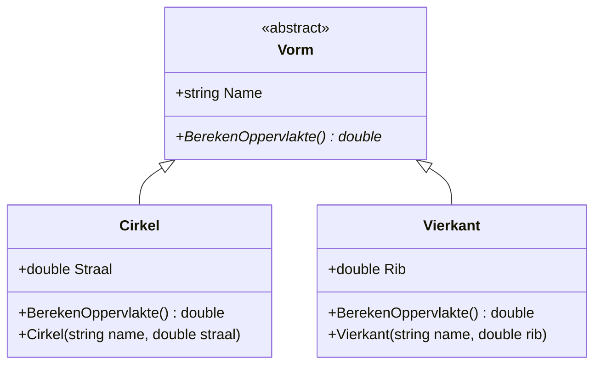

# Polymorfisme
Voorbeeld van polymorfisme, een van de fundamentele eigenschappen van Object Oriented Programming.

## Wat is Polymorfisme?
Polymorfisme betekent letterlijk "vele vormen" en stelt objecten in staat om verschillende gedragingen te vertonen afhankelijk van hun werkelijke type, terwijl ze allemaal via dezelfde interface benaderd kunnen worden.

## Project Uitleg
Dit project demonstreert polymorfisme door gebruik te maken van een abstracte basisklasse `Vorm` en twee concrete implementaties: `Cirkel` en `Vierkant`.

### Klassenstructuur
- **Vorm** (abstracte klasse): Definieert de basisstructuur met een `Name` eigenschap en een abstracte methode `BerekenOppervlakte()`
- **Cirkel**: Implementeert `Vorm` en berekent de oppervlakte met π × straal²
- **Vierkant**: Implementeert `Vorm` en berekent de oppervlakte met rib²

### Hoe Polymorfisme Werkt
In `Program.cs` wordt getoond hoe één variabele van type `Vorm` verschillende concrete objecten kan bevatten:

```csharp
// Dezelfde variabele kan verschillende vormen aannemen
Vorm deVorm = new Cirkel("cirkel", 100);    // deVorm gedraagt zich als een Cirkel
deVorm = new Vierkant("vierkant", 100);     // Nu gedraagt deVorm zich als een Vierkant
```

Ondanks dat beide objecten via dezelfde `Vorm` referentie benaderd worden, wordt de juiste `BerekenOppervlakte()` methode aangeroepen dankzij polymorfisme.

## Class Diagram
Het volgende class diagram toont de relaties tussen de klassen:



## Hoe te gebruiken
1. Compileer het project met `dotnet build`
2. Voer het programma uit met `dotnet run`
3. Het programma toont de berekende oppervlaktes van zowel de cirkel als het vierkant
